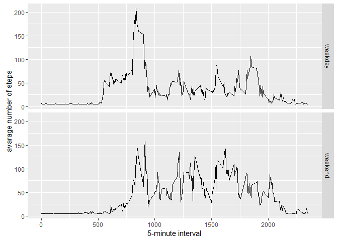

# Reproducible Research: Peer Assessment 1


## Loading and preprocessing the data

#### Load the data


```r
if(!file.exists('activity.csv')){
    unzip('activity.zip')
}
activity.data <- read.csv('activity.csv')
```


#### Process/transform the data (if necessary) into a format suitable for your analysis

- not necessary

## What is mean total number of steps taken per day?


```r
steps.by.day <- tapply(activity.data$steps, activity.data$date, sum, na.rm=TRUE)
```

#### Make a histogram of the total number of steps taken each day


```r
library(ggplot2)
```

```
## Warning: package 'ggplot2' was built under R version 3.2.4
```

```r
qplot(steps.by.day, xlab='Total steps per day', ylab='Frequency (binwidth 400)', binwidth=400)
```

<!-- -->


#### Calculate and report the mean and median total number of steps taken per day

```r
steps.by.day.mean <- mean(steps.by.day)
steps.by.day.median <- median(steps.by.day)
```

The mean steps per day are 9354.2295082 and the median is 10395.

## What is the average daily activity pattern?


```r
average.daily.pattern <- aggregate(x=list(mean.steps=activity.data$steps), by=list(interval=activity.data$interval), FUN=mean, na.rm=TRUE)
```


#### Make a time series plot


```r
ggplot(data=average.daily.pattern, aes(x=interval, y=mean.steps)) +
    geom_line() +
    xlab("5-minute interval") +
    ylab("average number of steps") 
```

<!-- -->

#### Which 5-minute interval, on average across all the days in the dataset, contains the maximum number of steps?


```r
most.steps <- which.max(average.daily.pattern$mean.steps)
interval.most.steps <-  gsub("([0-9]{1,2})([0-9]{2})", "\\1:\\2", average.daily.pattern[most.steps,'interval'])
```

Most steps are done at 8:35.

## Imputing missing values

####  Calculate and report the total number of missing values in the dataset


```r
num.na.steps <- sum(is.na(activity.data$steps))
```

The total number of missing values in the dataset is 2304.

#### Devise a strategy for filling in all of the missing values in the dataset.

Take the mean of all other values and replace missing values with this value.

#### Create a new dataset that is equal to the original dataset but with the missing data filled in.


```r
library(Hmisc)
```

```
## Warning: package 'Hmisc' was built under R version 3.2.5
```

```
## Loading required package: lattice
```

```
## Loading required package: survival
```

```
## Warning: package 'survival' was built under R version 3.2.5
```

```
## Loading required package: Formula
```

```
## Warning: package 'Formula' was built under R version 3.2.3
```

```
## 
## Attaching package: 'Hmisc'
```

```
## Die folgenden Objekte sind maskiert von 'package:base':
## 
##     format.pval, round.POSIXt, trunc.POSIXt, units
```

```r
activity.data.imputed <- activity.data
activity.data.imputed$steps <- impute(activity.data$steps, fun=mean)
```

#### Make a histogram of the total number of steps taken each day and calculate and report the mean and median total number of steps taken per day.


```r
steps.by.day.imputed <- tapply(activity.data.imputed$steps, activity.data.imputed$date, sum)
qplot(steps.by.day.imputed, xlab='Total steps per day (Imputed)', ylab='Frequency (binwidth 400)', binwidth=400)
```

<!-- -->


```r
steps.by.day.mean.imp <- mean(steps.by.day.imputed)
steps.by.day.median.imp <- median(steps.by.day.imputed)
```

The mean steps per day are 1.0766189\times 10^{4} and the median is 1.0766189\times 10^{4}.

## Are there differences in activity patterns between weekdays and weekends?

#### Create a new factor variable in the dataset with two levels – “weekday” and “weekend” indicating whether a given date is a weekday or weekend day.


```r
activity.data.imputed$date.type <-  ifelse(as.POSIXlt(activity.data.imputed$date)$wday %in% c(0,6), 'weekend', 'weekday')
```


#### Make a panel plot containing a time series plot


```r
activity.data.imputed <- aggregate(steps ~ interval + date.type, data=activity.data.imputed, mean)
ggplot(activity.data.imputed, aes(interval, steps)) + 
    geom_line() + 
    facet_grid(date.type ~ .) +
    xlab("5-minute interval") + 
    ylab("avarage number of steps")
```

<!-- -->

